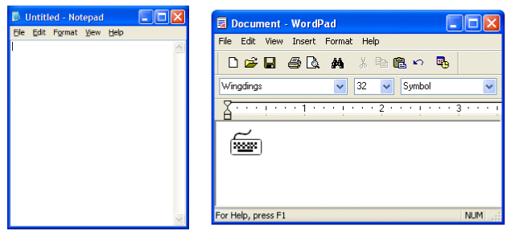
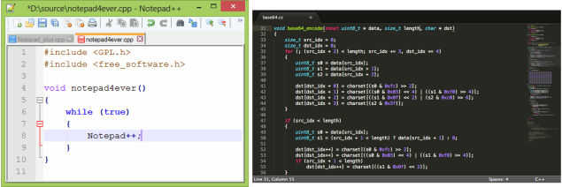
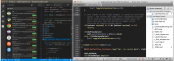
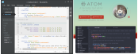
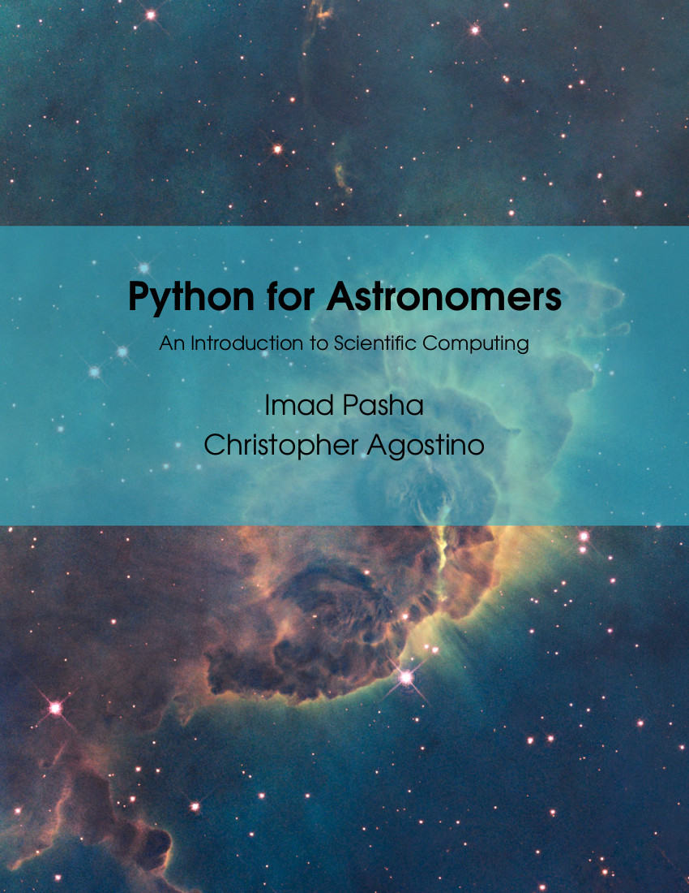

# Python Training Workshop 2018

## Table of Content
<!-- TOC -->

- [Python Training Workshop 2018](#python-training-workshop-2018)
    - [Table of Content](#table-of-content)
    - [Introduction](#introduction)
        - [Era of Computation](#era-of-computation)
        - [Python as a versatile language](#python-as-a-versatile-language)
            - [High-level language](#high-level-language)
            - [Object-oriented language](#object-oriented-language)
            - [Interpreted language](#interpreted-language)
            - [Users of Python](#users-of-python)
    - [Python Installation via Anaconda](#python-installation-via-anaconda)
    - [Python Packages](#python-packages)
        - [Different packages in Python](#different-packages-in-python)
        - [``conda`` : package management system for Anaconda](#conda--package-management-system-for-anaconda)
        - [``pip`` : a package management system in Python](#pip--a-package-management-system-in-python)
        - [``virtualenv``](#virtualenv)
        - [Create virtual Python environment in ``conda``](#create-virtual-python-environment-in-conda)
    - [Jupyter Notebook](#jupyter-notebook)
    - [Other ways to run Python](#other-ways-to-run-python)
        - [Python interpreter](#python-interpreter)
        - [Running a python script](#running-a-python-script)
        - [Text editors for python scripts](#text-editors-for-python-scripts)
        - [Spyder](#spyder)
        - [Online Platforms](#online-platforms)
    - [Train Python in spare time](#train-python-in-spare-time)
    - [Good Reference](#good-reference)
    - [Hand's on Session](#hands-on-session)
    - [Credits](#credits)

<!-- /TOC -->


## Introduction

Before introducing Python to you, there is a statistic on the ``pull`` requests
of different programming language in GitHub (Pull requests let you tell others
about changes you've pushed to a repository on GitHub, i.e. let others know you
want to make some changes to the branch.)


> In 2017, Python replaced Java as the second-most popular language on GitHub,
with 40 percent more pull requests opened this year than last. (Statistics from
https://octoverse.github.com/)

Could that be a reason that you should learn Python? 

### Era of Computation

As a beginner tutorial, I try not to assume anyone reading this snippet having
a programming or computer science background. But I will expect they do have
some common computer knowledge (at least knows how to Google). Concepts in
programming can be very abstract, especially when you work in data types and
algorithm. But I will try to explain the background knowledge when necessary.

Although it is still arguable that learning computer languages or coding is
essential in the future (Or every child should learn coding), it is undoubtedly
that programming language plays an important role in our future. One can
imagine that having some knowledge in programming will beneficial to job
hunting in the future. In Science research, we do a lot of numerical
calculations and data reductions which rely heavily on efficient program. And
sometimes, research students are required to code themselves. 

### Python as a versatile language

Python is a **high-level** ,**object-oriented** and **Interpreted** programming language.  

#### High-level language

Python is a high-level language which means that the user can care less
about memory management or proper declaration of variables. It is less
abstract than low-level language and less time to write and compile. The
syntax can be expressed similar to English prose or mathematical equations.
But it has relatively slower running time than some low-level language. 

I find the snippet from stackoverflow.com is quite useful:
https://stackoverflow.com/a/3468098

A list of programming languages ranging from very low to very high level:

* ``Machine Code`` could probably be considered the lowest level programming
language.

* ``Assembly language`` is at the level of telling the processor what to do.
There is still a conversion step towards machine code.

* ``C`` is a step up from assembler, because you get to specify what you want
to do in slightly more abstract terms, but you're still fairly close to the
metal.

* ``C++`` does everything that ``C`` can do but adds the capability to abstract
things away into classes.

* ``Java/C#`` do similar things to ``C++`` in a way, but without the
opportunity to do everything you can do in ``C``. They have garbage collection
though, which you have to do manually in ``C++``.

* ``Python/Ruby`` are even higher level, and let you forget about a lot of the
details that you would need to specify in something like ``Java`` or ``C#``.

* ``SQL`` is even higher level (it's declarative). Just say "Give me all the
items in the table sorted by age" and it will work out the most efficient way
to carry this out for you.

#### Object-oriented language

Object-oriented language is an abstract term in computer science, which based
on the concept of "objects". An "object" may contain data, some form of fields,
some intrinsic functions. The explanation of object-oriented language will be
covered later in this snippet.

#### Interpreted language

Interpreted language means the evaluation of a line of code to obtain results
can happen immediately rather than having to go through a time-consuming,
compile and run cycle. Theoretically it speeds up the thinking and debug
process.

#### Users of Python

Python is a general-purpose language. It can solve a lot of problem that a
computer can solve. From numerical calculations, statistical analysis, to web
framework and user front end, users can do them in Python. Astronomy is a field
that utilize and develop many Python packages.

## Python Installation via Anaconda

Anaconda is a popular tool to install Python among data scientists. It is
suggested beginner can install this distribution to minimize the problem.
Please refers to the following instructions:

- [Installing Python on Mac OS](installing-on-macos.md)
- [Installing Python on Microsoft Windows](installing-on-windows.md)
- [Installing Python on Linux](installing-on-linux.md)

## Python Packages

The term "package" refers to a distribution of a bundle of Python software.
Don't mix this ''distribution'' up with a larger distribution of software as
with a Linux distribution or Anaconda. Installing Python Package is not
difficult, but you need to know the name of the package.

### Different packages in Python
* sympy
* numpy
* matplotlib
* scipy
* scikit-learn
* pandas

### ``conda`` : package management system for Anaconda

Anaconda distribution have their own package management system called
``conda``. To use ``conda``, one should have open a proper Anaconda Python
setup as the instruction. And the ``conda`` command in terminal is working (any
terminal in MacOS/Linux; ``Anaconda prompt`` in MS Windows Start menu.)

To search/install packages:
* ``` conda search xxxxxx```
* ```conda install xxxxxx```
* Other commands:
http://conda.pydata.org/docs/_downloads/conda-cheatsheet.pdf

### ``pip`` : a package management system in Python

To search/install packages:
* Search package : ```pip search xxxxxx```
* Install package : ```pip install xxxxxx```
* Upgrade package : ```pip install --upgrade xxxxxx```
* Uninstall package : ```pip uninstall xxxxxx```
* Install wheel package :``` pip install xxxxxx.whl```

### ``virtualenv``
``virtualenv`` is a tool to create isolated Python environments. 
Simply open your terminal and type 

* ```virtualenv ENV```, where ENV is a directory to place the new virtual environment.
* Example:
  * ```virtualenv ~/newpython/```, which create a `newpython` directory under your home directory.
* To use : ```source ENV/bin/activate```
  * Example: ```source ~/newpython/bin/activate```.
* To end and deactivate the session : ```source deactivate```

### Create virtual Python environment in ``conda``
``conda`` has its own version to create a separated Python environment.
* To create : ```conda create -n yourenvname python=x.x anaconda```
* Example:
  * ```conda create -n py3 python=3.6 anaconda``` to create a Python 3 environment even you are using Python 2.
  * ```conda create -n py2 python=2.7 anaconda``` , vice versa.
* To use : ```source activate yourenvname```
* To end and deactivate the session : ```source deactivate```

## Jupyter Notebook

- [How to Start and Run a Jupyter Notebook](notebook.html)

## Other ways to run Python

### Python interpreter
For Linux / OSX, type ```python``` in terminal.
For windows, open ```Anaconda``` folder in Start menu. 

### Running a python script
You can always check the python version by running its interpreter.

A common shebang line used for the Python interpreter is as follows:
```#!/usr/bin/env python```

You must then make the script executable, using the following command:
```chmod +x xxxxxxxxx.py```

### Text editors for python scripts
First, get yourself a text editor.
Avoid using old-school editor like the notepad.


Proper text editor:
* [Notepad++](https://notepad-plus-plus.org/) (Windows)
* [Sublime Text](https://www.sublimetext.com/) (Windows, MacOS, Linux)
* [Atom](https://atom.io/) (Windows, MacOS, Linux), developed by GitHub.
* [Brackets](http://brackets.io/) (Windows, MacOS, Linux), developed by Adobe.
* [Visual Studio Code](http://macromates.com/) (Windows, MacOS, Linux), developed by Microsoft.
* [Textmate]() (MacOS)
* [gedit]() (MacOS)
* [Geany]() (Linux)

Terminal based editor:
* vim
* emacs
* nano





### Spyder


Spyder - The **S**cientific **PY**thon **D**evelopment **E**nvi**R**onment

Features:

- Editor
- Interactive console
- Documentation viewer
- Variable explorer
- Find in files
- File explorer
- History log


### Online Platforms


## Train Python in spare time
 - Online Judge


## Good Reference
- stackoverflow.com

{:height="50%" width="50%"}

- [Book: Python for Astronomers](http://ugastro.berkeley.edu/pydecal/textbook.pdf)

{:height="50%" width="50%"}

## Hand's on Session

The hand's on session requires a working python installations with jupyter installed. The following links are read-only, they do not run calculations in your computer. In case you would like to have a copy, run the following command in your computer (Linux and Mac):
```bash
git clone --depth 1 https://github.com/ryan-leung/PHYS4650_Python_Tutorial
```
These Jupyter notebooks are stored under `notebook` sub-directory.

- [Python Syntax](https://nbviewer.jupyter.org/github/ryan-leung/PHYS4650_Python_Tutorial/blob/master/notebook/python-syntax.ipynb)
- [Python Intrinsic Data Type](https://nbviewer.jupyter.org/github/ryan-leung/PHYS4650_Python_Tutorial/blob/master/notebook/python-intrinsic-data-type.ipynb)
- [Python Data Structures](https://nbviewer.jupyter.org/github/ryan-leung/PHYS4650_Python_Tutorial/blob/master/notebook/python-data-structures.ipynb)
- [Python Conditionals And Loops](https://nbviewer.jupyter.org/github/ryan-leung/PHYS4650_Python_Tutorial/blob/master/notebook/python-conditionals-and-loops.ipynb)
- [Python Functions And Class](https://www.google.com)
- [Python plotting with matplotlib](https://www.google.com)
- [Problem solving example 1](https://www.google.com)
- [Problem solving example 2](https://www.google.com)

## Credits
This tutorial have referenced the following materials:
- [Unidata's online-python-training](https://github.com/Unidata/online-python-training)
- [Anaconda Installation Guide](https://conda.io/docs/user-guide/install/index.html)