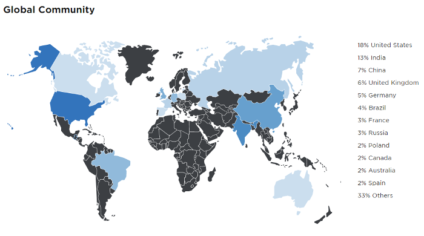
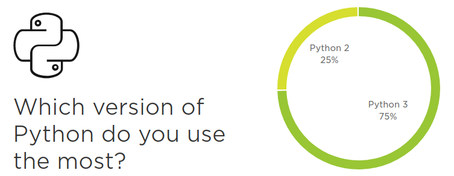
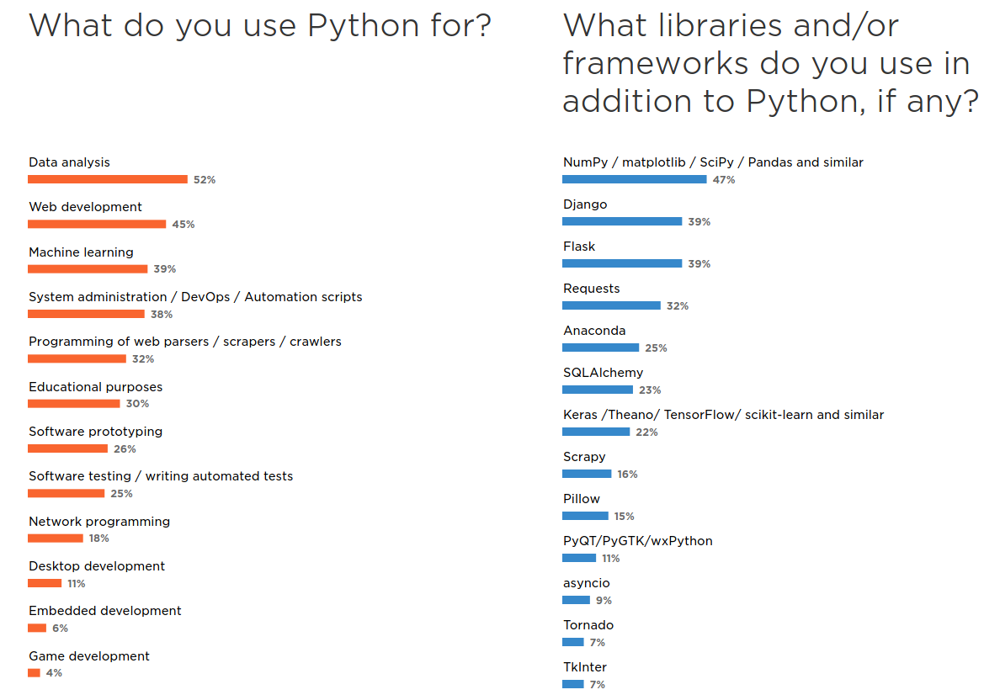
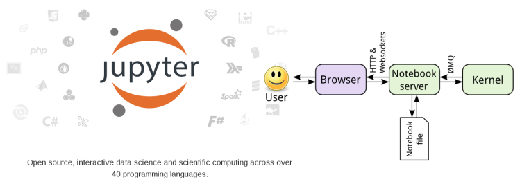
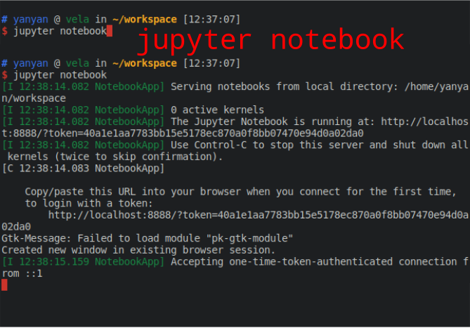
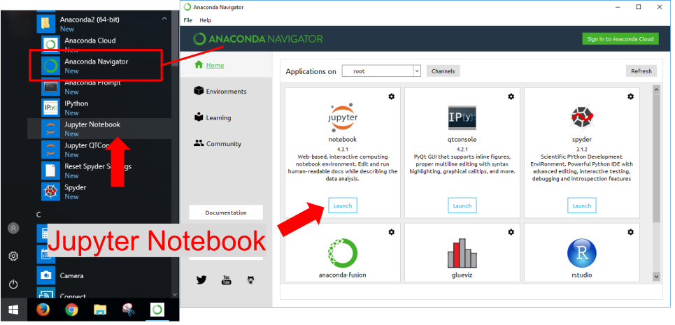
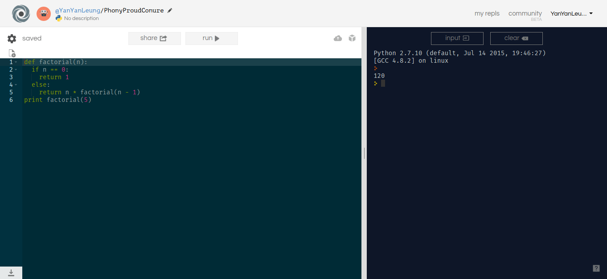
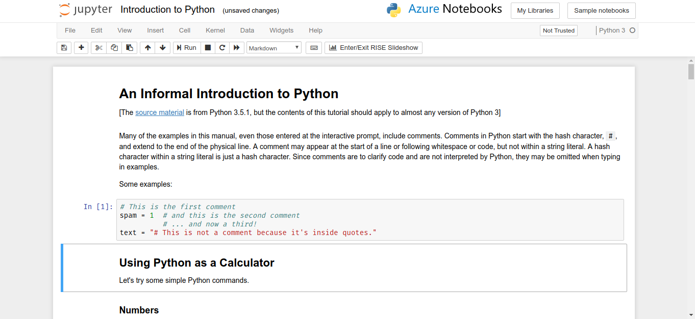
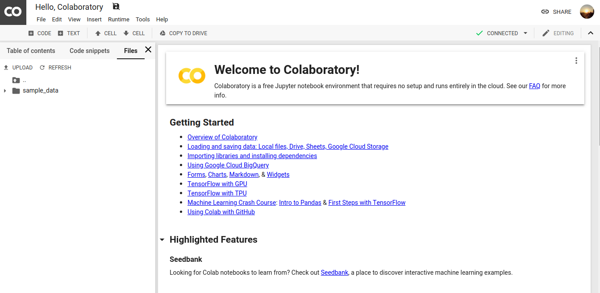

<!-- $theme: default -->

# Python Training Workshop 2019
## An introduction course to Python
### Jan 31, 2019
Ryan Leung 
(yanyan.ryan.leung@gmail.com)

Please go to
<div style="color: #000000; font-family: monospace; font-size: 1em;">
https://tinyurl.com/y6wzrkl5 (introduction)
</div>
<div style="color: #000000; font-family: monospace; font-size: 1em;">
https://tinyurl.com/ybz69nux (hands-on materials)
</div>
<div style="color: #000000; font-family: monospace; font-size: 1em;">
https://tinyurl.com/ybz69nux (Download all notebooks)
</div>

---
## Python: a very fast-growing language
<center>

</center>

---
## A new era of computing

* Varieties of programming languages
* Multi-core CPU and GPU support
* Easily-accessible cloud computing
* Cloud microservices

---
## Python: a versatile language

<center>

</center>

* high-level
* object-oriented, and 
* Interpreted

programming language.  

---
## Python: a "High-level language"

* "Low level language": C, Fortran, Basic
* **Level** means the accessiblity to system resources.
* **High Level** : 
  * care less about memory management or proper declaration of variables
  * less abstract than low-level language
  * less time to write and compile
  * relatively slower running time than some low-level language (not always true).

---
## Community of Python users
* Web backend developers
* Data science
* Machine learning

<center>

</center>
<sub>
Image courtesy of the Python Developers Survey 2017 Results website
</sub>

---
## Python 2 vs Python 3
Results are quoted from https://www.jetbrains.com/research/devecosystem-2018/python/

<center>

</center>

---
## Python Usages

<center>

</center>

---
# Installation
* Refer to another guide
* Recommendation:
  * Anaconda
  * Google colab
  
---
## Install packages (with anaconda)
* ```conda search xxxxxx```
* ```conda install xxxxxx```

---
## Install packages (with ``pip``)

``pip`` is a package management system in Python

To search/install packages:
* Search package : ```pip search xxxxxx```
* Install package : ```pip install xxxxxx```
* Upgrade package : ```pip install --upgrade xxxxxx```
* Uninstall package : ```pip uninstall xxxxxx```
* Install wheel package :``` pip install xxxxxx.whl```

---
# Jupyter Notebook
You may want to run a Jupyter notebook when:
* You want to try out a new experiment or analysis with an existing Jupyter notebook from someone.
* You want to develop an algorithm that run on a large software.
* You have only ten minutes to download a data, plot a graph and send the email to your supervisor in a neat format.



---
## Open Jupyter in Linux/MacOS
Type 
```bash
jupyter notebook
```
<center>

</center>


---
## Open Jupyter in Windows
Open your Start menu, goes to ``Anaconda`` Folder,
Click the ``Jupyter Notebook`` shortcut (Recommended). Or start the ``Anaconda Navigator`` and ``Launch``


---

## Hand's on Session

The hand's on session requires a working python installations with Jupyter installed. The following links are read-only, they do not run calculations in your computer. 

---

## First Session:
- [Python Syntax](https://nbviewer.jupyter.org/github/ryan-leung/PHYS4650_Python_Tutorial/blob/master/notebooks/01-Python-Syntax.ipynb)
- [Python Data Structures](https://nbviewer.jupyter.org/github/ryan-leung/PHYS4650_Python_Tutorial/blob/master/notebooks/02-Python-Data-Structures.ipynb)
- [Python Numpy Array](https://nbviewer.jupyter.org/github/ryan-leung/PHYS4650_Python_Tutorial/blob/master/notebooks/03-Python-Numpy-Array.ipynb)

---
## Second Session:
- [Introduction to Pandas](https://nbviewer.jupyter.org/github/ryan-leung/PHYS4650_Python_Tutorial/blob/master/notebooks/04-Introduction-to-Pandas.ipynb)
- [Python Functions and Class](https://nbviewer.jupyter.org/github/ryan-leung/PHYS4650_Python_Tutorial/blob/master/notebooks/05-Python-Functions-Class.ipynb)
- [Python Matplotlib](https://nbviewer.jupyter.org/github/ryan-leung/PHYS4650_Python_Tutorial/blob/master/notebook/06-Python-Matplotlib.ipynb)
- [Python plotting with Astropy and AplPy](https://nbviewer.jupyter.org/github/ryan-leung/PHYS4650_Python_Tutorial/blob/master/notebooks/07-Python-Astropy-Aplpy.ipynb)

---
## Online Platforms
Here are some online Python platform that are quite good indeed.

- [c9.io]()
- [repl.it](https://repl.it/)
- [Microsoft Azure Notebooks](https://notebooks.azure.com/)
- [Google Colab](https://colab.research.google.com/)

---

repl.it

---

Azure Notebook

---

Google Colab

---
## Online Judge

* [Sphere Online Judge (SPOJ)](http://www.spoj.com/)
* [HackerRank](https://www.hackerrank.com/)
* [CodeAcademy](https://www.codecademy.com/)
* [Aizu Online Judge (AOJ)](http://judge.u-aizu.ac.jp/onlinejudge/index.jsp)

---
## Good Reference Material
- stackoverflow.com

<center>

</center>


- https://github.com/jakevdp/PythonDataScienceHandbook

<center>

</center>

- [Book: Python for Astronomers](http://ugastro.berkeley.edu/pydecal/textbook.pdf)

---
## Credits
This tutorial have referenced the following materials:
- [Unidata's online-python-training](https://github.com/Unidata/online-python-training)
- [Anaconda Installation Guide](https://conda.io/docs/user-guide/install/index.html)
- And thanks Sandy Chan and Stephen Ng